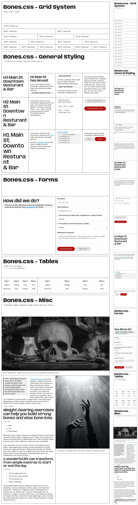
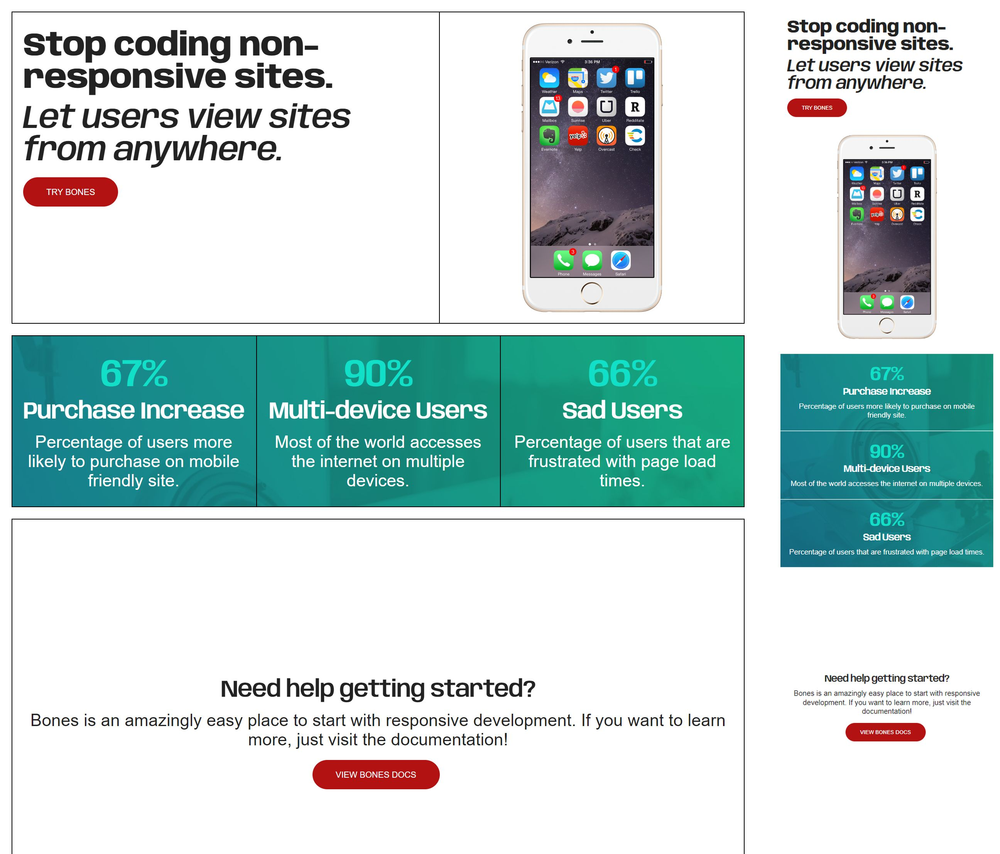

# Bones.css
Bones.css is an easy responsive boilerplate, configurable styles with CSS variables, to kickstart any responsive project.

---

This was designed for simplicity. In the end, I want to eliminate having the dev make a million different decisions to design a simple site. I don't want them to think about class names or how to follow a convention. Too many boilerplates that are suppose to make responsive design easier, contain inside utility classes you need to learn, memorize and think about. My success for this project would be so you don't think about it, you style the page with simple, inline elements. I want to eliminate the hurdle to learning many different utility class names. I don't want to keep redesigning the stylesheet to continue implementing custom classes that fit certain pages. 

It's still a work in progress, but my end goal would be something simple to read that is designed in HTML like this, and still looks good:
```
<html>
<head>
  <title>bones.css</title>
</head>

<body>
<!-- Grid is a based on the number 12. To get a complete row, you need to equal 12. With your rows. -->
<!-- E.g. Cell7 + Cell5, or Cell4, 3 times, to equal 12. -->
<!-- Consider Grid, to be your new <section> for layouts. -->
    <Grid>
        <Cell7>
          <h1>This is a heading</h1>
          <p>This is a paragraph.</p>
        </Cell7>

        <Cell5>
            <figure></figure>            
        </Cell5>
    </Grid>
    
    <Grid class="center values">
      	<Cell4>
      		<h1>67%</h1>
      		<h4>Purchase Increase </h4>
      		<p>Percentage of users more likely to purchase on mobile friendly site.</p>
      	</Cell4>
          	
      	<Cell4>
      		<h1>90%</h1>
      		<h4>Multi-device Users</h4>
      		<p>Most of the world accesses the internet on multiple devices.</p>
      	</Cell4>
      	
      	<Cell4>
      		<h1>66%</h1>
      		<h4>Sad Users</h4>
      		<p>Percentage of users that are frustrated with page load times.</p>
        <Cell4>
    </Grid>
    	
    <Grid class="center whitespace">
         <Cell12>
            <h4>Need help getting started?</h4>
              <p>Bones is an amazingly easy place to start with responsive development. If you want to learn more, just visit the documentation!</p>
            <button class="primary">View Bones Docs</button>
          </Cell12>
    </Grid>
</body>
</html>
```

- [Example Index Page(codepen.io)](https://codepen.io/CalvinMorett/full/NWEjNQr)
- [Example Landing Page(codepen.io)](https://codepen.io/CalvinMorett/full/RwqZYbb)





---

## Browser support
- Chrome latest
- Firefox latest
- Opera latest
- Safari latest
- IE latest

## License
All parts of Skeleton are free to use and abuse under the [open-source MIT license](https://github.com/dhg/Skeleton/blob/master/LICENSE.md).

## Acknowledgement

Skeleton was created by [Dave Gamache](https://twitter.com/dhg) for a better web.
