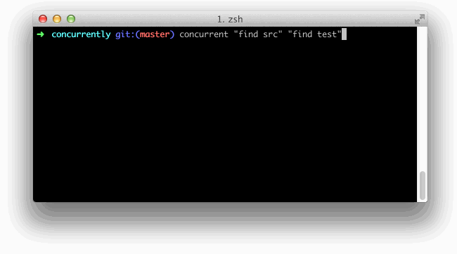

# Concurrently

[](https://travis-ci.org/kimmobrunfeldt/concurrently)

**Version: 2.2.0** ([*previous stable*](https://github.com/kimmobrunfeldt/concurrently/tree/2.1.0))

Run multiple commands concurrently.
Like `npm run watch-js & npm run watch-less` but better.



**Features:**

* Cross platform, works also in Windows
* Output is easy to follow with prefixes
* With `--kill-others` switch, all commands are killed if one dies


## Install

The tool is written in Node.js, but you can use it to run **any** commands.

```bash
npm install -g concurrently
```

## Usage

Remember to surround separate commands with quotes, like this:
```bash
concurrently "command1 arg" "command2 arg"
```

Otherwise **concurrently** would try to run 4 separate commands:
`command1`, `arg`, `command2`, `arg`.

Help:

```
Usage: concurrently [options] <command ...>

Options:

  -h, --help                        output usage information
  -V, --version                     output the version number
  -k, --kill-others                 kill other processes if one exits or dies
  --no-color                        disable colors from logging
  --names                           names different processes, i.e --name "web,api,hot-server" to be used in the prefix switch
  -p, --prefix <prefix>             prefix used in logging for each process.
  Possible values: index, pid, time, command, name, none or a template. Default: index. Example template "{time}-{pid}"

  -tf, --timestamp-format <format>  specify the timestamp in moment format. Default: YYYY-MM-DD HH:mm:ss.SSS

  -r, --raw                         output only raw output of processes, disables prettifying and concurrently coloring
  -s, --success <first|last|all>    Return exit code of zero or one based on the success or failure of the "first" child to terminate, the "last" child, or succeed  only if "all" child processes succeed. Default: all

  -l, --prefix-length <length>      limit how many characters of the command is displayed in prefix.
  The option can be used to shorten long commands.
  Works only if prefix is set to "command". Default: 10


Examples:

 - Kill other processes if one exits or dies

     $ concurrently --kill-others "grunt watch" "http-server"

 - Output nothing more than stdout+stderr of child processes

     $ concurrently --raw "npm run watch-less" "npm run watch-js"

 - Normal output but without colors e.g. when logging to file

     $ concurrently --no-color "grunt watch" "http-server" > log

 - Custom prefix

     $ concurrently --prefix "{time}-{pid}" "grunt watch" "http-server"

For more details, visit https://github.com/kimmobrunfeldt/concurrently
```

## FAQ

* Process exited with code *null*?

    From [Node child_process documentation](http://nodejs.org/api/child_process.html#child_process_event_exit), `exit` event:

    > This event is emitted after the child process ends. If the process
    > terminated normally, code is the final exit code of the process,
    > otherwise null. If the process terminated due to receipt of a signal,
    > signal is the string name of the signal, otherwise null.


    So *null* means the process didn't terminate normally. This will make **concurrent**
    to return non-zero exit code too.


## Why

I like [task automation with npm](http://substack.net/task_automation_with_npm_run)
but the usual way to run multiple commands concurrently is
`npm run watch-js & npm run watch-css`. That's fine but it's hard to keep
on track of different outputs. Also if one process fails, others still keep running
and you won't even notice the difference.

Another option would be to just run all commands in separate terminals. I got
tired of opening terminals and made **concurrently**.

### NPM Issue

Previously I thought this could fix some problems I had with watching scripts and this readme said:

> When running watch or serve tasks, I'd recommend to use `--kill-others` option:
>
> ```bash
> concurrently --kill-others "npm run watch-js" "npm run watch-less"
> ```
>
> That way, if for some reason e.g. your `watch-less` died, you would notice it easier.

However NPM didn't work as I hoped it would. See [this issue](https://github.com/kimmobrunfeldt/concurrently/issues/4).
